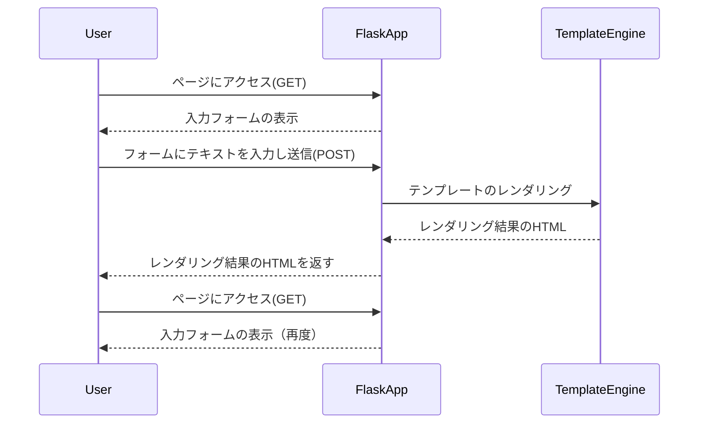

reference:[https://msiz07-flask-docs-ja.readthedocs.io/ja/latest/]

- [Usage](#usage)
- [Q\&A](#qa)
  - [zarigani](#zarigani)
  - [usage](#usage-1)
  - [Pythonの「スライス」](#pythonのスライス)
  - [if __name__ == '__main__':](#if-name--main)
  - [HTMLフォーム](#htmlフォーム)
  - [A Mermaid diagram showing the flow of Flask's Python processing and template processing.](#a-mermaid-diagram-showing-the-flow-of-flasks-python-processing-and-template-processing)

# Usage

```bash
$ python app.py

$ curl -X POST -H "Content-Type: application/json" -d '{"text":"I am zarigani"}' http://localhost:5000/transform
```

# Q&A

## zarigani

もちろんです、以下に、あなたの要求に基づくFlaskのアプリケーションのコードを示します：

```python
from flask import Flask, request, jsonify

app = Flask(__name__)

TARGET_WORD = 'ザリガニ'  # This is the word we want to transform
TRANSFORMED_WORD = 'ザリ　ガニガニ'  # This is what we will transform it into

@app.route('/transform', methods=['POST'])
def transform_text():
    data = request.json
    text = data.get('text', '')
    # Perform the text transformation
    transformed_text = text.replace(TARGET_WORD, TRANSFORMED_WORD)
    return jsonify({'transformed_text': transformed_text})

if __name__ == '__main__':
    app.run(debug=True)
```

このアプリケーションは、POSTリクエストとともにJSON形式でテキストを受け取り、そのテキスト内の指定された単語を変換し、結果をJSON形式で返します。ここでは 'ザリガニ' を 'ザリ　ガニガニ' に変換します。

このコードを使うと、あなたが変換したい単語とその結果を簡単に変更することができます。ただし、大文字と小文字の違いに注意してください。`replace`メソッドは大文字と小文字を区別しますので、異なるケースを考慮に入れたい場合は、適切な変換を行うための追加のロジックが必要になるかもしれません。

## usage

もちろんです、Flaskのアプリケーションをローカルで実行するための基本的な手順は以下の通りです：

1. **PythonとFlaskのインストール:** Pythonがまだインストールされていない場合は、[公式ウェブサイト](https://www.python.org/downloads/)からダウンロードしてインストールします。Pythonがインストールされたら、コマンドラインからFlaskをインストールします。これは通常次のように行います:

   ```bash
   pip install flask
   ```

   これはPythonのパッケージマネージャーであるpipを使用してFlaskをインストールします。

2. **アプリケーションのコードの作成:** 上記のコードをテキストエディタにコピーして貼り付け、`app.py`という名前のPythonファイルとして保存します。

3. **アプリケーションの実行:** コマンドライン（またはターミナル）を開き、アプリケーションのファイルが保存されているディレクトリに移動します。そして、次のコマンドを入力してアプリケーションを実行します:

   ```bash
   python app.py
   ```

4. **アプリケーションへのアクセス:** 上記のコマンドを実行すると、アプリケーションはデフォルトでhttp://127.0.0.1:5000（またはhttp://localhost:5000）で実行されます。しかし、このアプリケーションはPOSTリクエストを待ち受けるよう設計されているため、ブラウザから直接アクセスするのではなく、PostmanのようなHTTPクライアントツール、またはcurlコマンドなどを使用してリクエストを送信します。

   たとえば、次のようなcurlコマンドを使用できます:

   ```bash
   curl -X POST -H "Content-Type: application/json" -d '{"text":"私はザリガニが好きです"}' http://localhost:5000/transform
   ```

   このコマンドは、'私はザリガニが好きです'というテキストを含むJSONデータをPOSTリクエストとして送信します。レスポンスとして、テキストが変換されたバージョンが返されます。

## Pythonの「スライス」

もちろんです！

この2つの行はPythonの「スライス」操作を使用しています。スライスは、リストや文字列の一部を取り出すための操作です。

1. `first_part = text[:-2]`

    この行は、`text`文字列の最初から最後から3文字目までの部分を取得します。`[:-2]`というスライスは、「最初から最後から2文字目まで」という意味になります。たとえば、`text`が「ゼニガメ」だった場合、`first_part`は「ゼニ」になります。

2. `last_part = text[-2:]`

    この行は、`text`文字列の最後から2文字目から最後までの部分を取得します。`[-2:]`というスライスは、「最後から2文字目から最後まで」という意味になります。たとえば、`text`が「ゼニガメ」だった場合、`last_part`は「ガメ」になります。

このように、Pythonのスライス操作を使用すると、文字列やリストの特定の部分を簡単に取り出すことができます。

## if __name__ == '__main__':

この行はPythonスクリプトが直接実行されたとき、つまりコマンドラインからこのスクリプトが実行されたときにのみ、`app.run(debug=True)`が呼び出されるようにしています。

`__name__ == '__main__'`という条件は、このPythonファイルが直接実行された場合にのみ真となります。つまり、このPythonファイルが他のPythonファイルによってインポートされた場合は、この条件は偽となり、`app.run(debug=True)`は実行されません。

`app.run(debug=True)`は、Flaskアプリケーションを起動するコードです。`debug=True`パラメータは、デバッグモードを有効にするためのもので、デバッグモードが有効の場合、エラーメッセージが詳細に表示されたり、コードの変更が即時に反映されたりします。

ですから、この行は「このPythonファイルが直接実行された場合、つまり、このファイルがアプリケーションのエントリーポイント（最初に実行される部分）である場合にのみ、Flaskアプリケーションを起動する」という意味になります。

## HTMLフォーム

以下のようにHTMLフォームを使ってデータを受け取り、そのデータを変換して表示するようにしてみましょう。

```python
from flask import Flask, request, render_template

app = Flask(__name__)

@app.route('/', methods=['GET', 'POST'])
def transform_text():
    transformed_text = ""
    if request.method == 'POST':
        text = request.form['text']

        # Split the string into two parts
        first_part = text[:2]
        last_part = text[2:]

        repeated_first_part = first_part * 2

        transformed_text = repeated_first_part + ' ' + last_part

    return render_template('index.html', transformed_text=transformed_text)

if __name__ == '__main__':
    app.run(debug=True)
```

ここではFlaskのrender_template関数を使って、HTMLテンプレートを表示しています。HTMLテンプレートでは、変換されたテキストを表示するための変数`transformed_text`を使っています。

そして、以下のようなHTMLファイル（index.html）をFlaskのtemplatesフォルダ内に作成します。

```html
<!doctype html>
<html>
  <head>
    <title>Text Transformer</title>
  </head>
  <body>
    <form method="POST">
      <label for="text">Enter text:</label>
      <input type="text" id="text" name="text" required>
      <input type="submit" value="Submit">
    </form>
    
      <h2>Transformed Text:</h2>
      <p>{{ transformed_text }}</p>
    
  </body>
</html>
```

このHTMLファイルはテキスト入力欄と送信ボタンがあるシンプルなフォームを定義しています。ユーザーがテキストを入力して送信ボタンをクリックすると、そのテキストはFlaskアプリケーションにPOSTリクエストとして送信されます。そして、テキストが変換されてその結果が表示されます。

## A Mermaid diagram showing the flow of Flask's Python processing and template processing.



上記の図では、ユーザーがブラウザからアプリにアクセスし、入力フォームが表示されます（GETリクエスト）。  
ユーザーがテキストを入力してフォームを送信すると、Flaskアプリケーションはテキストを処理し、テンプレートエンジンにレンダリングの要求を送ります（POSTリクエスト）。  
テンプレートエンジンは、指定されたテンプレートを基にHTMLを生成し、それをFlaskアプリケーションに返します。  
Flaskアプリケーションは、生成されたHTMLをブラウザに返し、ユーザーは結果を表示されます。  
ユーザーが再度アクセスすると、同じ流れが繰り返されます。